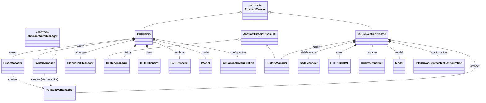
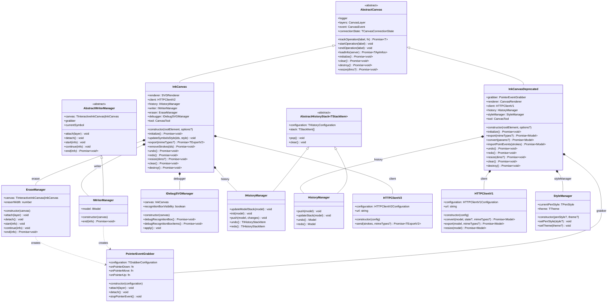

# InkCanvas — Architecture

`InkCanvas` is the HTTP batch editor variant (INKV2 protocol — simpler, stateless, `Canvas.load(element, "INKV2", options)`). It is a **sibling** of `InteractiveInkCanvas`, not a subclass — both extend the same `AbstractCanvas` base.

The legacy `InkCanvasDeprecated` (INKV1, `@deprecated`) is documented alongside it since it shares the base class and illustrates why `InkCanvas` was introduced, but new code should never use it.

## Overview

Notes:
- `EraseManager` and `AbstractWriterManager` are **shared** with `InteractiveInkCanvas` (typed to accept either canvas) — they are not `InkCanvas`-exclusive.
- `InkCanvasDeprecated` does **not** reuse `EraseManager`/`AbstractWriterManager`: it hand-rolls pointer handling directly (`onPointerDown`/`onPointerMove`/`onPointerUp`) plus a bare `PointerEventGrabber`.
- `ColorPaletteManager` is **not** used anywhere in this graph — it's exclusive to `InteractiveInkCanvas`'s math/overlay managers.

## Complete

## Source files

| Class | File |
|---|---|
| `InkCanvas` | `src/canvas/variants/InkCanvas.ts` |
| `InkCanvasDeprecated` | `src/canvas/variants/InkCanvasDeprecated.ts` |
| `AbstractCanvas` | `src/canvas/AbstractCanvas.ts` |
| `IWriterManager` (simple) | `src/manager/simple/IWriterManager.ts` |
| `AbstractWriterManager` / `EraseManager` | `src/manager/base/` |
| `IDebugSVGManager` | `src/manager/debug/IDebugSVGManager.ts` |
| `IHistoryManager` / `HistoryManager` / `AbstractHistoryStack` | `src/history/` |
| `HTTPClientV2` / `HTTPClientV1` | `src/client/` |
| `StyleManager` | `src/style/StyleManager.ts` |
| `PointerEventGrabber` | `src/grabber/PointerEventGrabber.ts` |
