# InteractiveInkCanvas — Architecture

`InteractiveInkCanvas` is the WebSocket real-time editor variant (`Canvas.load(element, "INTERACTIVE_INK", options)`). It orchestrates ~18 managers, a `WebSocketClient`, an `SVGRenderer` and an `IIModel`.

## Overview

Composition only — canvas, its direct manager fields, and the base inheritance chain.

```mermaid
classDiagram
  AbstractCanvas <|-- InteractiveInkCanvas
  TInteractiveInkCanvas <|.. InteractiveInkCanvas : implements

  InteractiveInkCanvas *-- IIHistoryManager : history
  InteractiveInkCanvas *-- IIWriterManager : writer
  InteractiveInkCanvas *-- IIKeyboardManager : keyboard
  InteractiveInkCanvas *-- EraseManager : eraser
  InteractiveInkCanvas *-- IISelectionManager : selector
  InteractiveInkCanvas *-- IIMoveManager : move
  InteractiveInkCanvas *-- IIGestureManager : gesture
  InteractiveInkCanvas *-- IITransformManager : transform
  InteractiveInkCanvas *-- IIConversionManager : converter
  InteractiveInkCanvas *-- IITypesetManager : typeset
  InteractiveInkCanvas *-- IIOverlayManager : overlays
  InteractiveInkCanvas *-- IISnapManager : snaps
  InteractiveInkCanvas *-- IISynchronizerManager : synchronizer
  InteractiveInkCanvas *-- IIJiixQueryManager : jiix
  InteractiveInkCanvas *-- IIMathManager : math
  InteractiveInkCanvas *-- IIConnectorManager : connector
  InteractiveInkCanvas *-- IIMenuManager : menu
  InteractiveInkCanvas *-- IIPlaybackManager : playback

  InteractiveInkCanvas o-- IIModel : model
  InteractiveInkCanvas o-- SVGRenderer : renderer
  InteractiveInkCanvas o-- WebSocketClient : client

  IITransformManager *-- IITranslateManager : translate
  IITransformManager *-- IIResizeManager : resize
  IITransformManager *-- IIRotationManager : rotation
  IISelectionManager ..> IITransformManager : rotation/translate/resize getters

  IIMathManager *-- IIMathComputationSubManager : computation
  IIMathManager *-- IIMathVariableSubManager : variables
  IIMathManager *-- IIMathFunctionEvaluationSubManager : evaluation
  IIMathManager *-- IIMathCapabilitiesSubManager : capabilities

  IIMathVariableSubManager ..> ColorPaletteManager : uses (singleton)
  IIOverlayManager ..> ColorPaletteManager : uses (singleton)
```

Notes:
- `IIMenuManager` lives in `src/menu/`, not `src/manager/`.
- `ColorPaletteManager` (`src/manager/base/ColorPaletteManager.ts`) is a singleton, only reached two levels down (`IIOverlayManager`, `IIMathVariableSubManager`) — `InteractiveInkCanvas` never touches it directly.
- `IIModel` / `SVGRenderer` are treated as opaque boxes here — see the symbol-system docs for their internals.

## Complete

Same graph, with every manager's superclass, constructor and **public** method/accessor signatures. Private/protected helpers are omitted (see source for those).

```mermaid
classDiagram
  class AbstractCanvas {
    <<abstract>>
    +logger
    +layers: CanvasLayer
    +event: CanvasEvent
    +connectionState: TCanvasConnectionState
    +trackOperation(label, fn) Promise~T~
    +startOperation(label) void
    +endOperation(label) void
    +hasOperation(label) boolean
    +loadInfo(server) Promise~TApiInfos~
  }

  class InteractiveInkCanvas {
    +renderer: SVGRenderer
    +client: WebSocketClient
    +history: IIHistoryManager
    +writer: IIWriterManager
    +keyboard: IIKeyboardManager
    +eraser: EraseManager
    +gesture: IIGestureManager
    +transform: IITransformManager
    +converter: IIConversionManager
    +typeset: IITypesetManager
    +selector: IISelectionManager
    +overlays: IIOverlayManager
    +snaps: IISnapManager
    +move: IIMoveManager
    +synchronizer: IISynchronizerManager
    +jiix: IIJiixQueryManager
    +math: IIMathManager
    +connector: IIConnectorManager
    +menu: IIMenuManager
    +playback: IIPlaybackManager
    +constructor(rootElement, options?)
    +initialize() Promise~void~
    +addSymbol(sym, addToHistory?) Promise~TSymbol~
    +addSymbols(symList, addToHistory?) Promise~TSymbol[]~
    +updateSymbol(sym, addToHistory?) Promise~TSymbol~
    +removeSymbol(id, addToHistory?) Promise~void~
    +select(ids) void
    +selectAll() void
    +unselectAll() void
    +convert(symbols?) Promise~void~
    +export(mimeTypes?) Promise~TExport~
    +synchronize() void
    +undo() Promise~IIModel~
    +redo() Promise~IIModel~
    +duplicate(symbols?) Promise~TSymbol[]~
    +copy() void
    +paste() Promise~void~
    +cut() void
    +zoom(zoom, cx?, cy?) void
    +zoomToFit(symbols?) void
    +pan(...) void
    +resize(dims?) Promise~void~
    +clear() Promise~void~
    +destroy() Promise~void~
    +downloadAsSVG(selection?) void
    +downloadAsPNG(selection?) void
    +downloadAsJson(selection?) void
    +downloadAsText(selection?) void
    +changeLanguage(code) Promise~void~
    +waitForIdle() Promise~void~
  }
  AbstractCanvas <|-- InteractiveInkCanvas

  class IIAbstractManager {
    <<abstract>>
    +canvas: TInteractiveInkCanvas
    +logger
    +model: IIModel
    +renderer: SVGRenderer
    +client: WebSocketClient
    +configuration: InteractiveInkCanvasConfiguration
    +destroy() void
  }

  class AbstractWriterManager {
    <<abstract>>
    +canvas: TInteractiveInkCanvas|InkCanvas
    +grabber
    +currentSymbol
    +detectGesture: boolean
    +attach(layer) void
    +detach() void
    +start(info) void
    +continue(info) void
    +end(info)* Promise~void~
  }

  class IIWriterManager {
    +tool: CanvasWriteTool
    +constructor(canvas)
    +attach(layer) void
    +detach() void
    +start(info) void
    +continue(info) void
    +end(info) Promise~void~
  }
  AbstractWriterManager <|-- IIWriterManager

  class IIKeyboardManager {
    +constructor(canvas)
    +attach() void
    +detach() void
    +resetStoredTool() void
  }
  IIAbstractManager <|-- IIKeyboardManager

  class EraseManager {
    +canvas: TInteractiveInkCanvas|InkCanvas
    +eraserWidth: number
    +constructor(canvas)
    +attach(layer) void
    +detach() void
    +start(info) void
    +continue(info) void
    +end(info) Promise~void~
  }

  class IISelectionManager {
    +constructor(canvas)
    +selectionBox: TBox
    +attach(layer) void
    +detach() void
    +start(info) void
    +continue(info) TSymbol[]
    +end(info) TSymbol[]
    +isMathBlockSelected(id) boolean
  }
  IIAbstractManager <|-- IISelectionManager

  class IIMoveManager {
    +constructor(canvas)
    +attach(layer) void
    +detach() void
    +start(info) void
    +continue(info) void
    +end(info) void
  }
  IIAbstractManager <|-- IIMoveManager

  class IIGestureManager {
    +constructor(canvas, gestureAction?)
    +apply(gesture) Promise~void~
    +getGestureFromContextLess(stroke) Promise~TGesture~
  }
  IIAbstractManager <|-- IIGestureManager

  class IITransformManager {
    +translate: IITranslateManager
    +resize: IIResizeManager
    +rotation: IIRotationManager
    +constructor(canvas)
  }
  IIAbstractManager <|-- IITransformManager

  class IIAbstractTransformManager {
    <<abstract>>
    +setTransformOrigin(id, ox, oy) void
    +applyToSymbol(symbol, matrix) TSymbol
  }
  IIAbstractManager <|-- IIAbstractTransformManager

  class IITranslateManager {
    +constructor(canvas)
    +translate(symbols, tx, ty, addToHistory?) Promise~void~
    +start(target, origin) void
    +continue(point) object
    +end(point) Promise~void~
  }
  class IIResizeManager {
    +constructor(canvas)
    +scaleElement(id, sx, sy) void
    +start(target, origin) void
    +continue(point) object
    +end(point) Promise~void~
  }
  class IIRotationManager {
    +constructor(canvas)
    +rotateElement(id, degree) void
    +start(target, origin) void
    +continue(point) number
    +end(point) Promise~void~
  }
  IIAbstractTransformManager <|-- IITranslateManager
  IIAbstractTransformManager <|-- IIResizeManager
  IIAbstractTransformManager <|-- IIRotationManager
  IITransformManager *-- IITranslateManager
  IITransformManager *-- IIResizeManager
  IITransformManager *-- IIRotationManager

  class IIConversionManager {
    +constructor(canvas)
    +convertText(text, strokes, onlyText) object
    +convertNode(node, strokes) object
    +convertEdge(edge, strokes) object
    +convertMath(mathElement, strokes) object
    +apply(symbols?) Promise~TSymbol[]~
  }
  IIAbstractManager <|-- IIConversionManager

  class IITypesetManager {
    +constructor(canvas)
    +rowHeight: number
    +getSymbolRowIndex(symbol) number
    +getBoundingBox(text) TBox
    +setBounds(symbol) void
    +updateBounds(typesetSymbol) T
    +moveTextAfter(text, tx) TSymbol[]
  }
  IIAbstractManager <|-- IITypesetManager

  class IIOverlayManager {
    +constructor(canvas, config?)
    +refresh() void
    +clearAll() void
    +highlightPrimary(id, bounds, color?) void
    +highlightLinked(id, bounds) void
    +showVariableEncart(options) void
    +hideVariableEncart() void
    +apply() void
  }
  IIAbstractManager <|-- IIOverlayManager

  class IISnapManager {
    +constructor(canvas, config?)
    +snapResize(point, h?, v?) TPoint
    +snapTranslate(tx, ty) TSnapNudge
    +snapRotation(angle) number
    +drawSnapToElementLines(lines) void
  }
  IIAbstractManager <|-- IISnapManager

  class IISynchronizerManager {
    +constructor(canvas)
    +synchronize() Promise~void~
  }
  IIAbstractManager <|-- IISynchronizerManager

  class IIJiixQueryManager {
    +constructor(canvas)
    +invalidateIndex() void
    +getElementForStroke(strokeId) TJIIXElement
    +getStrokeIdsForBlock(blockId) string[]
    +getLabelForStroke(strokeId) string
    +searchByLabel(label) TStrokeQueryResult[]
    +getIndexStats() object
  }
  IIAbstractManager <|-- IIJiixQueryManager

  class IIMathManager {
    +constructor(canvas, config?)
    +computeNumericalResult(blockId, mode?) Promise~object~
    +forceCompute(blockIds?) Promise~void~
    +setVariableValue(blockId, name, value) Promise~void~
    +getVariables(blockId) Promise~TMathVariable[]~
    +getDependencies(blockId) TMathDependencies
    +evaluateFunction(blockId, evaluation) Promise~object~
    +selectBlock(blockId) void
  }
  IIAbstractManager <|-- IIMathManager
  IIMathManager *-- IIMathComputationSubManager : computation
  IIMathManager *-- IIMathVariableSubManager : variables
  IIMathManager *-- IIMathFunctionEvaluationSubManager : evaluation
  IIMathManager *-- IIMathCapabilitiesSubManager : capabilities

  class IIConnectorManager {
    +constructor(canvas)
    +findSymbolAtPoint(point, excludeId) TSymbol
    +showAnchorHint(point, excludeId) TSymbol
    +applyEndpointAnchor(edge, pointIndex, point) void
    +updateAnchoredEdges(symbolIds, matrix?, bounds?) void
  }
  IIAbstractManager <|-- IIConnectorManager

  class IIMenuManager {
    +constructor(canvas, custom?)
    +render(layer) void
    +show() void
    +hide() void
    +update() void
    +destroy() void
  }

  class IIPlaybackManager {
    +constructor(canvas)
    +state: TPlaybackState
    +play(strokes, speed?) void
    +pause() void
    +resume() void
    +stop() void
  }
  IIAbstractManager <|-- IIPlaybackManager

  class AbstractHistoryStack~TStackItem~ {
    <<abstract>>
    +configuration: THistoryConfiguration
    +event: CanvasEvent
    +stack: TStackItem[]
    +pop() void
    +clear() void
  }
  class IIHistoryManager {
    +isChangesEmpty(changes) boolean
    +init(model) void
    +push(model, changes) void
    +undo() TIIHistoryStackItem
    +redo() TIIHistoryStackItem
  }
  AbstractHistoryStack <|-- IIHistoryManager

  class ColorPaletteManager {
    <<singleton>>
    +getInstance()$ ColorPaletteManager
    +getColorForVariable(name) string
    +getAllVariableColors() Map
  }

  InteractiveInkCanvas *-- IIHistoryManager : history
  InteractiveInkCanvas *-- IIWriterManager : writer
  InteractiveInkCanvas *-- IIKeyboardManager : keyboard
  InteractiveInkCanvas *-- EraseManager : eraser
  InteractiveInkCanvas *-- IISelectionManager : selector
  InteractiveInkCanvas *-- IIMoveManager : move
  InteractiveInkCanvas *-- IIGestureManager : gesture
  InteractiveInkCanvas *-- IITransformManager : transform
  InteractiveInkCanvas *-- IIConversionManager : converter
  InteractiveInkCanvas *-- IITypesetManager : typeset
  InteractiveInkCanvas *-- IIOverlayManager : overlays
  InteractiveInkCanvas *-- IISnapManager : snaps
  InteractiveInkCanvas *-- IISynchronizerManager : synchronizer
  InteractiveInkCanvas *-- IIJiixQueryManager : jiix
  InteractiveInkCanvas *-- IIMathManager : math
  InteractiveInkCanvas *-- IIConnectorManager : connector
  InteractiveInkCanvas *-- IIMenuManager : menu
  InteractiveInkCanvas *-- IIPlaybackManager : playback
```

## Source files

| Class | File |
|---|---|
| `InteractiveInkCanvas` | `src/canvas/variants/InteractiveInkCanvas.ts` |
| `TInteractiveInkCanvas` | `src/canvas/TInteractiveInkCanvas.ts` |
| `AbstractCanvas` | `src/canvas/AbstractCanvas.ts` |
| `IIAbstractManager` | `src/manager/interactive/IIAbstractManager.ts` |
| Transform managers | `src/manager/interactive/transform/` |
| Math sub-managers | `src/manager/interactive/math/` |
| `IIHistoryManager` / `AbstractHistoryStack` | `src/history/` |
| `IIMenuManager` | `src/menu/IIMenuManager.ts` |
| `ColorPaletteManager` | `src/manager/base/ColorPaletteManager.ts` |
| `WebSocketClient` | `src/client/WebSocketClient.ts` — see [websocket-protocol.md](websocket-protocol.md) |
