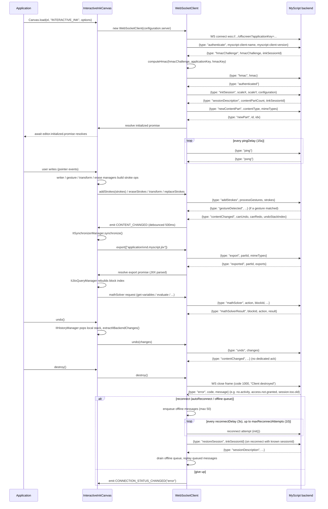

# WebSocket protocol — InteractiveInkCanvas ↔ MyScript backend

Full message lifecycle used by `InteractiveInkCanvas` (`src/canvas/variants/InteractiveInkCanvas.ts`) via `WebSocketClient` (`src/client/WebSocketClient.ts`) against the MyScript Cloud recognition server. All message shapes come from `TWebSocketClientMessageType` in `src/client/WebSocketClientMessage.ts`.

> Note: the `debug-websocket` and `recognizer-system` project skills describe a different, outdated protocol (`src/recognizer/...`, message types like `strokesAdded`/`sessionInitialized`) — that path no longer exists in the codebase. This document reflects the current `src/client/WebSocketClient.ts` implementation; treat it as the source of truth.

## Message reference

| Direction | `type` | Purpose | Handler |
|---|---|---|---|
| C→S | `authenticate` | Open handshake, client identity | `WebSocketClient.openCallback()` |
| S→C | `hmacChallenge` | Challenge string to HMAC-sign | `manageHMACChallenge()` |
| C→S | `hmac` | Computed HMAC response | — |
| S→C | `authenticated` | Auth accepted | `manageAuthenticated()` |
| C→S | `initSession` / `restoreSession` | Open new or resume existing session | `manageAuthenticated()` |
| S→C | `sessionDescription` | Session id + content part count | `manageSessionDescriptionMessage()` |
| C→S | `newContentPart` / `openContentPart` | Create or reopen a content part | — |
| S→C | `newPart` / `partChanged` | Part ready, resolves `initialized` | `manageNewPartMessage()` / `managePartChangeMessage()` |
| C→S | `ping` | Keepalive (every 15s, worker-driven) | `initPing()` |
| S→C | `pong` | Keepalive ack | `messageCallback()` |
| C→S | `addStrokes` | New stroke batch (chunks of 1000) | `addStrokes()` |
| C→S | `replaceStrokes` / `transform` / `eraseStrokes` / `contextlessGesture` | Edit operations | see `WebSocketClient.ts` |
| S→C | `contentChanged` | Model changed server-side, triggers re-sync | `manageContentChangedMessage()` |
| S→C | `gestureDetected` / `contextlessGesture` | Gesture classification result | `manageGestureDetected()` |
| C→S | `export` | Request export in given mime types | `export()` |
| S→C | `exported` | Export payload (e.g. JIIX) | `manageExportMessage()` |
| C→S | `mathSolver` | Math variable/evaluation request | — |
| S→C | `mathSolverResult` | Math solver response | `manageMathSolverResult()` |
| C→S | `undo` / `redo` | Backend-side change replay for undo/redo | `undo()` / `redo()` |
| S→C | `error` | Server error (`no.activity`, `access.not.granted`, `session.too.old`, `restore.session.not.found`) | `manageErrorMessage()` |
| — | WS close frame | Clean/unclean disconnect | `closeCallback()`, `ClientError.mapCloseCodeToMessage()` |

## Reconnection & offline queue

Two independent mechanisms in `WebSocketClient.ts`:
1. **Legacy auto-reconnect in `send()`** — if the socket is closing/closed and `configuration.server.websocket.autoReconnect` is true (default), retries `init()` + the send, up to `maxRetryCount` (default 2).
2. **Offline queue + background reconnect loop** — if `offlineQueueEnabled` (default true), `addStrokes()` queues locally (max 50) while disconnected; a timer retries every `reconnectDelay` (default 3000ms) up to `maxReconnectAttempts` (default 10), then drains the queue in order. Gives up and emits `CONNECTION_STATUS_CHANGED("error")` if exhausted.

## Source files

| Concern | File |
|---|---|
| Protocol state machine | `src/client/WebSocketClient.ts` |
| Message type enum + payload shapes | `src/client/WebSocketClientMessage.ts` |
| HMAC/applicationKey config | `src/client/ServerConfiguration.ts` |
| HMAC computation | `src/utils/crypto.ts` |
| Public event surface | `src/client/ClientEvent.ts` |
| Close-code → message mapping | `src/client/ClientError.ts` |
| Editor-side wiring (init/undo/redo/export/destroy) | `src/canvas/variants/InteractiveInkCanvas.ts` |
| Debounced JIIX re-sync after `contentChanged` | `src/manager/interactive/IISynchronizerManager.ts` |
